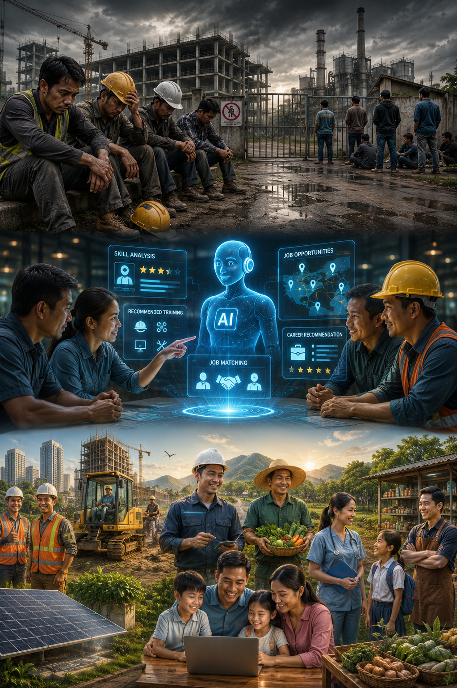

# AI Community Solution

## Overview
This project presents an AI-powered concept designed to help people who are struggling to find employment.

## The Challenge
Many people in my community face unemployment, making it difficult to support their families and build a stable future.

## The Solution
This AI-powered assistant helps users:
- Create professional resumes (CVs)
- Find suitable job opportunities
- Prepare for interviews
- Learn new skills through personalized recommendations

## Expected Impact
- Reduce unemployment
- Improve family income
- Increase confidence among job seekers
- Build stronger communities

## How AI Helped
AI helped me explore the problem, generate ideas, and visualize a practical solution for my community.

**Created for the Goodwall AI Community Challenge**
